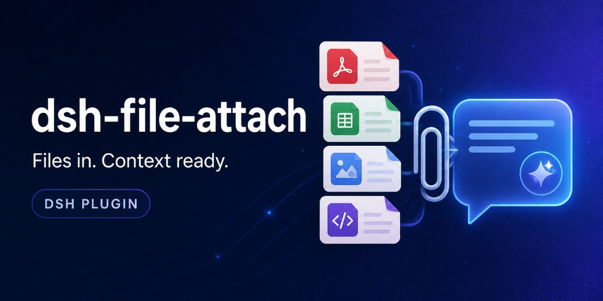

<p align="center">
  
</p>

# dsh-file-attach

<p>
  <a href="README.md">English</a> ·
  <a href="README.zh-CN.md">简体中文</a>
</p>

[](https://github.com/LucasXingg/dsh-file-attach/actions/workflows/ci.yml)
[](https://github.com/LucasXingg/dsh-file-attach/releases)
[](LICENSE)
[](https://github.com/topics/dsh-plugin)

`dsh-file-attach` is a host-and-web DSH plugin for attaching local files to a
conversation. It accepts any non-empty file within the configured size limit,
extracts supported documents into model-readable text, and stores the original
outside the session workspace. PNG, JPEG, WebP, and GIF images take DSH's
native vision path when the selected model explicitly supports image input;
otherwise the plugin uploads them for OCR and an optional text description.

Unsupported binary formats can still be uploaded and saved into the workspace,
but their prompt extract is only a “no text extractor” note.

## What the plugin adds

- Page-wide drag and drop, image paste handling, a multi-file picker, and an
  **Attach files…** entry in DSH's `/` menu.
- English and Chinese labels, status text, and upload error notifications.
- 1 MiB sequential chunk uploads with aggregate progress and extraction status.
- A composer-aligned dock showing plugin-uploaded files and their sizes.
- Extractors for text/code, PDF, DOCX, XLSX, PPTX, Jupyter notebooks, and
  raster images.
- Model-aware routing between DSH native vision and plugin OCR/extraction.
- Hidden model context: the model receives the extract, while the rendered
  conversation shows only a compact attachment header.
- Four model-facing tools for notebook inspection, PDF page OCR, image
  description, and saving the original file.
- Session-scoped vault storage, filename/path sanitization, upload admission
  limits, partial-upload cleanup, and a persisted-extract lookup endpoint.

## Requirements and installation

- Node.js 22.13 or newer.
- DSH with the Cordis host and web client plugin system.

Install the npm package into the `web` profile:

```sh
npx @deepseek-ai/dsh plugin --profile web add --allow-build=tesseract.js @lucasxingg/dsh-file-attach
```

Until the package is on npm, install from GitHub instead:

```sh
npx @deepseek-ai/dsh plugin --profile web add --allow-build=tesseract.js github:LucasXingg/dsh-file-attach
```

pnpm 10+ blocks dependency build scripts. OCR uses `tesseract.js`, which has one, so the first add without `--allow-build=tesseract.js` fails with `ERR_PNPM_IGNORED_BUILDS`. That is **not** a successful install.

If you already hit that error, allow the script in the profile and re-run:

```sh
# ~/.dsh/profiles/web/pnpm-workspace.yaml
allowBuilds:
  tesseract.js: true
```

Do **not** run `add dsh-file-attach`. That unscoped npm name is a different plugin
(`dsh-file-attach@1.0.0`) and will not provide drag-and-drop or `/attach`.

Alternatively, download the package from
[GitHub Releases](https://github.com/LucasXingg/dsh-file-attach/releases)
or clone this repository, run `npm ci` in the checkout, then add that
directory:

```sh
npx @deepseek-ai/dsh plugin --profile web add /path/to/dsh-file-attach
```

Restart `dsh web` and refresh the browser after installation. The running GUI
does not hot-install the bundle. `cordis.patch.yml` adds one
`file-attach` row; the package exposes both the host entry (`lib/index.js`) and
the generated browser entry (`lib/client.js`).

## Attaching files

| Input | Actual behavior |
|---|---|
| Drag and drop | A capture-phase page-wide listener claims every file drop. With no active session it still prevents the browser default, logs a console warning, and discards the files without a toast. |
| Paste | The plugin claims a paste only when it contains at least one supported raster image. It routes every file in that paste and appends any plain clipboard text to the draft. A file-only paste with no raster image is left to DSH. |
| `/` menu | Select **Attach files…** to open a multi-file picker with no file-type filter. |
| Dock **Add** button | Opens the same picker. The dock is rendered only after a plugin upload has started, so use drop, paste, or the `/` menu for the first attachment. |
| `/attach <id>` | Reuses a known attachment reference. In the same page lifetime it can submit the cached extract; after reload it sends a degraded ID hint because filename/size metadata is not persisted. |

On the plugin upload path, empty files and files larger than `maxFileBytes` are
rejected in the client and again by the host. Native-vision image admission is
owned by DSH instead. Plugin uploads are accepted only for a live session. If
the composer is busy (its phase is neither `plain` nor `claimed`), plugin
uploads are refused with a notification.

Files routed to the plugin from one batch start independently; the client does
not queue them or pre-check `maxConcurrentUploads`. The dock combines all
in-flight files into one aggregate progress bar. On each file's final request,
the label switches to extraction while progress is held at an approximate 95%.
After extraction, the reference chip is inserted at the end of the draft with
up to two revision-guarded attempts. If insertion fails, the client shows an
error, but the completed file remains in the vault and ready dock.

### Image routing

Only PNG, JPEG, WebP, and GIF are classified as raster images.

1. The client asks the host about the currently selected provider/model.
2. The host resolves model metadata.
3. `visual: true` is returned only when `inputModalities` explicitly includes
   `image`.
4. Visual-model images are handed to DSH's native composer image rail.
5. Unknown, failed, or text-only model lookups fall back to plugin upload,
   OCR, and optional description.
6. If the native composer image API rejects the batch, the plugin also falls
   back to its upload path.

Native-vision images are not copied into this plugin's vault, do not receive a
12-character attachment ID, do not appear in its dock, and cannot be used with
the `attach_*` tools. In a mixed batch, native images follow the vision path
while all other files are uploaded by the plugin.

## Supported extraction

| Input | Detection | Extract sent to the model |
|---|---|---|
| Text and source | `text/*` or a known extension such as `txt`, `md`, `csv`, `json`, `html`, `css`, `js`, `ts`, `py`, `go`, `rs`, `java`, `c/cpp`, `sh`, `yaml`, `toml`, `sql`, and others | UTF-8 text; invalid byte sequences are replaced. |
| PDF | `.pdf` or `application/pdf` | Merged text layer. A PDF with no text layer produces a note directing the model to `attach_pdf_ocr_page`. |
| Word | `.docx` or the DOCX MIME type | Raw text from Mammoth. Legacy `.doc` is not supported. |
| Excel | `.xlsx` or the XLSX MIME type | Sheet headings and tab-separated cell values. Legacy `.xls` is not supported. |
| PowerPoint | `.pptx` or the PPTX MIME type | Slide headings and text recovered from slide XML. Legacy `.ppt` is not supported. |
| Jupyter notebook | `.ipynb` | Every cell's type and source; for non-display text outputs, only the final two lines per cell are included in the initial extract. |
| Raster image | PNG, JPEG, WebP, or GIF by MIME type or extension | Format/dimensions when detectable, Tesseract OCR, and an optional short LLM description. This path is used only when native vision is unavailable or fails. |
| Other binary | Anything else | A note naming the unsupported extension and MIME type. The original remains available to `attach_save`. |

Every extract is capped at `maxExtractChars`. Truncation is marked in the text
and in the persisted extract metadata. Extraction errors do not discard a
completed upload: the original and an error extract are kept so the agent can
still use `attach_save`.

### Image OCR and automatic description

The OCR worker is reused and recreated when `ocrLanguages` changes. With
`explainImages: true`, the plugin also attempts a best-effort one-shot caption
through the first available LLM provider and model. Captioning requires both
the `llm` and `attachments` services; missing services, missing model identity,
timeouts, and failures leave OCR intact and add no fatal upload error.

## What the model and user see

For a successful plugin upload, the submitted model text is:

```text
[attached file "report.pdf" (2.4 MB) id=a1b2c3d4e5f6]
----- extracted content -----
…extracted text…
----- end -----
```

The browser removes the extract fence from rendered conversation text and
shows only the attachment header, including when the conversation splits one
bubble into several nodes or collapses the newlines around the markers. The
underlying submitted message still contains the extract. Vault paths are never
put into the prompt.

The 12-character lowercase hexadecimal `id` is the preferred identifier for
all tools. A filename also works when exactly one upload in the current
session's vault has that basename; duplicate names require the ID.

Attachment metadata is held in browser memory. After a page reload, a restored
reference does not recover the original filename and size, so it degrades to:

```text
[attached file id=a1b2c3d4e5f6 — extraction unavailable after reload; use attach_* tools with id a1b2c3d4e5f6]
```

The original and `extract.json` still exist in the vault, and the tools can
resolve the original by ID.

## Model-facing tools

All four tools return text. Domain errors are reported as tool errors. They
operate only on plugin-uploaded files in the current session vault.

### `attach_notebook_output`

Returns one complete Jupyter cell: its index/type, source, every text output,
errors/tracebacks, and omitted non-text MIME bundle names and byte sizes.

```json
{"id":"a1b2c3d4e5f6","cell":0}
```

- `id` — attachment ID or a unique notebook filename.
- `cell` — zero-based index; non-integers and out-of-range values fail.
- The attachment must have an `.ipynb` filename.

### `attach_pdf_ocr_page`

Rasterizes one PDF page at 2× scale and OCRs it with `ocrLanguages`.

```json
{"id":"a1b2c3d4e5f6","page":1}
```

- `id` — attachment ID or a unique PDF filename.
- `page` — one-based positive integer.
- The attachment must have a `.pdf` filename.
- Returns `(no OCR text on page N)` when recognition is empty.

### `attach_describe_image`

Starts the configured `describeProvider` subagent with a custom prompt.

```json
{"id":"a1b2c3d4e5f6","prompt":"List every visible UI label"}
```

- `id` — attachment ID or a unique filename.
- `prompt` — required non-empty instruction.
- Requires the DSH subagent service. When the attachment service is available,
  the original bytes are passed as an image; otherwise the subagent receives
  only the filename alongside the prompt.
- The implementation does not enforce an image extension, although the tool is
  intended for PNG/JPEG/WebP/GIF uploads.
- Returns the subagent's text output, `(empty description)`, or a tool error
  when the subagent cannot complete.

### `attach_save`

Copies the untouched original from the vault into the session workspace.

```json
{"id":"a1b2c3d4e5f6","path":"docs/report.pdf"}
```

- `id` — attachment ID or a unique original filename.
- `path` — destination relative to the session workspace.
- Parent directories are created automatically.
- Paths resolving to the workspace root or outside it are rejected.
- An existing destination file is overwritten.
- Returns the normalized workspace-relative destination path.

## Host HTTP surface

These routes support the bundled web client; they are not a separate public
remote API.

| Method and route | Purpose |
|---|---|
| `POST /api/dsh-file-attach/upload` | Opens or continues a chunk upload; validates the live session, metadata, limits, chunk headers, and final byte count; extracts and persists the completed file. |
| `POST /api/dsh-file-attach/abort` | Best-effort removal of an in-progress upload directory by upload ID. |
| `GET /api/dsh-file-attach/extract` | Returns persisted `extract.json` for a valid upload ID in a live session. |
| `GET /api/dsh-file-attach/config` | Returns client-visible limits and supported raster MIME types. |
| `GET /api/dsh-file-attach/vision` | Resolves whether the selected/current session model explicitly accepts image input. |

Upload requests carry metadata in `x-session-id`, `x-file-name`,
`x-file-type`, `x-file-size`, `x-chunk-index`, `x-chunk-count`, and, after the
first chunk, `x-upload-id` headers. Chunks for each upload are serialized by
the host. An individual request body is capped at `maxFileBytes + 1 MiB`.

The config response exposes `maxFileBytes`, `maxFilesPerMessage`,
`maxConcurrentUploads`, `vaultDir`, `maxExtractChars`, `explainImages`,
`ocrLanguages`, and the raster MIME list. It does not expose
`explainTimeoutMs`, `describeProvider`, or the fixed client chunk size.

## Configuration

Edit the `config` object on the `file-attach` row in `cordis.patch.yml`.

| Key | Default | Actual effect |
|---|---:|---|
| `maxFileBytes` | `52428800` (50 MiB) | Per-file admission limit, checked by client and host. |
| `maxFilesPerMessage` | `20` | Reported to the client, but the current client does **not** enforce a per-message count. |
| `maxConcurrentUploads` | `20` | Maximum open host upload sessions; additional first chunks receive HTTP 429. |
| `vaultDir` | `file-attach` | Subdirectory of `$DSH_HOME` (or `~/.dsh`) containing originals and extracts. |
| `maxExtractChars` | `80000` | Character cap applied to each initial extract. |
| `explainImages` | `true` | Enables best-effort automatic LLM captions on the plugin image path. |
| `ocrLanguages` | `eng+chi_sim` | Tesseract language IDs used for image and PDF-page OCR. |
| `explainTimeoutMs` | `30000` | Abort timeout for automatic image captions. |
| `describeProvider` | `spawn` | Provider passed to `attach_describe_image` when starting a subagent. |

The upload chunk size is fixed in the bundled client at 1 MiB and is not a
configuration key.

## Storage, cleanup, and security

Plugin uploads are stored at:

```text
$DSH_HOME/file-attach/<sanitized-session-id>/<12-char-id>/
├── <sanitized-original-name>
└── extract.json
```

If `$DSH_HOME` is unset, the base is `~/.dsh`. `vaultDir` replaces the
`file-attach` segment. Filenames are reduced to a basename, stripped of control
characters and leading dots, trimmed, and capped at 200 characters. Session
IDs are reduced to one safe path segment.

Aborted and failed partial uploads are removed best-effort. Abandoned partial
uploads expire after 10 minutes and are swept once per minute. Completed
uploads are not garbage-collected: removing a composer reference does not
delete the original, and ready dock entries have no removal control. Plugin
teardown aborts active browser uploads and cleans open host upload sessions.

The routes are same-origin and live-session checks protect upload, extract, and
vision operations, but there is no separate bearer credential. The abort and
config routes do not require a session header. Bind DSH to `127.0.0.1` unless
an authenticated reverse proxy protects it. See [SECURITY.md](SECURITY.md).

## Current limitations

- Browser attachment metadata and dock state are not persisted across reloads.
- Reloaded `/attach <id>` references degrade to an ID hint instead of
  rehydrating the full extract into the prompt.
- Ready dock entries have no remove control and are not synchronized with
  removal of composer reference chips.
- `maxFilesPerMessage` is exposed but not enforced by the current client.
- Completed vault files have no automatic retention or garbage-collection
  policy.
- Scanned PDFs are not OCRed automatically at ingest; use
  `attach_pdf_ocr_page` one page at a time.
- Native-vision images bypass the plugin vault and tools.
- Automatic image captions choose the first available provider/model, not
  necessarily the conversation's selected model.
- The page-wide drop listener claims any file drop for the active session.
- Without an active session, a drop is consumed and discarded with only a
  console warning; the localized `noSession` toast is not currently used.
- Reference chips are appended at the draft end rather than inserted at the
  caret.
- Legacy Office formats (`.doc`, `.xls`, `.ppt`) have no extractor.
- SVG, BMP, TIFF, and other non-PNG/JPEG/WebP/GIF images do not use OCR or
  native vision; they follow text detection or unsupported-binary handling.
- OCR behavior depends on available Tesseract language data; automated tests
  stub the OCR and PDF raster backends rather than exercising real downloads.

## Development

```sh
npm ci
npm test
npm run build:client
git diff --exit-code -- lib/client.js
npm pack --dry-run
```

`src/client-core.js` and `src/client-app.js` are plain scripts assembled by
`scripts/build-client.mjs`; commit the regenerated `lib/client.js` whenever
either source changes. CI runs the test suite on Node.js 22 and 24 and verifies
the generated bundle and release package.

Project layout:

```text
lib/index.js              host routes, limits, lifecycle, and tool registration
lib/extract.js            text, Office, notebook, PDF, image, and OCR extraction
lib/ingest.js             admission, sanitization, vault paths, and model forms
lib/tools.js              attach_* tool definitions
lib/vision.js             current-model visual capability resolution
lib/client.js             generated browser bundle
src/client-core.js        pure browser helpers
src/client-app.js         browser plugin and UI behavior
scripts/build-client.mjs  browser bundle assembly
test/                     node:test suites
```

## Releases and contributing

The npm package name is `@lucasxingg/dsh-file-attach` (the unscoped name
`dsh-file-attach` is already taken). To publish from a machine logged in as
the npm user `lucasxingg`:

```sh
npm whoami   # must print lucasxingg
npm test
npm run build:client
npm publish --access public
```

Releases follow semantic versioning and are recorded in
[CHANGELOG.md](CHANGELOG.md). A matching `v*` tag runs tests, verifies the
generated client, packs the npm tarball, and publishes a GitHub Release with
generated notes.

See [CONTRIBUTING.md](CONTRIBUTING.md) for development guidance,
[SECURITY.md](SECURITY.md) for private vulnerability reporting, and
[LICENSE](LICENSE) for license terms.
